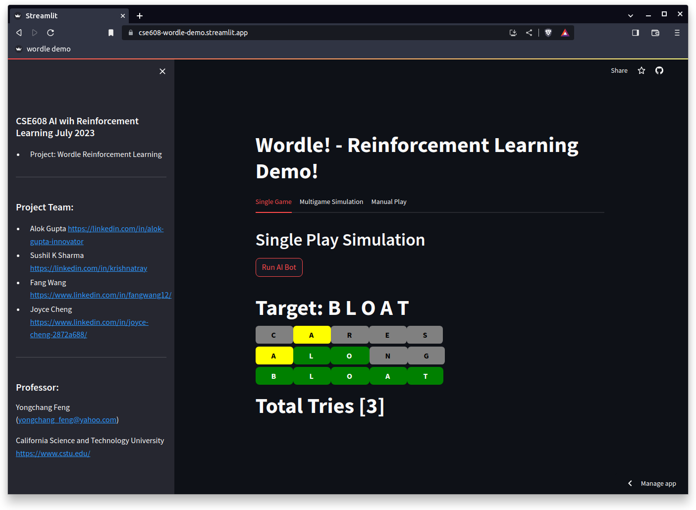

# cse608_rl_project
cse608_rl_project

#Project Summary

We are creating a wordle solver program based on Reinforcement learning.  There are at least 2 phases to this project:

1.  Non reinforcement learning base line example: In this example we are assuming that the state is the dictionary of possible words.  The action is the choice of next word.  The reward is the number of greens.  The expected number of greens for each potential word (Q Table) is caluculable from the dictionary. This represents a state explosion, but this analytical approach makes it possible, exactly.  This step has been completed and represents the baseline.
2.  Bellman equation (Reinforcement Learning) based example: In this version, we are using the # of the guess as the state.  The action is the choice of the next word.  The reward is the number of words eliminated by that guess.  This will be learned via te Bellman Equation.  The policy will be to use the word at a particular stage that has the highest expected number of eliminated words.  We will also eliminate words that are not consistent with the feedback of the previous stage.

At this time we have the basic modules working:
1. wordle_feedback(target_word, guess_word): This module takes a five letter guess_word and compares it with the 5 letter target_word.
2. is_consistent(word, feedback): This module compares a word with the feedback (from above) and returns a TRUE if the word is consistent with the feedback or FALSE othersise.  FALSE implies that the word cannot be a possible solution to the wordle game.
3. create_histogram(df):  This module creates a histogram for the letters as a function of position.  This is only relevant to phase 1.
4. one_hot_encode(word):  This creates a one hot encoded matrix of the word.  This is only relavant to phase 1.
5. np.sum(word_enc*histogram): This statement calucates the expected number of greens for a guess given the one hot encoding of the word (above) and the histogram (above).  This is the Q value.
6. play(DF,target_word):  This module plays the game according to phase 1 for a the original dictionary data frame (DF) and the target_word.

In order to complete phase 2, I will have to create modules to train and play the game with the Q tables that have been built.  A policy will be used in the play module. 

For now the code is in Wordle Functions.ipynb and the dictionary of possible words is 5_letter.csv.  You have to have these in the same folder to work in Jupyter notebook.  You have to save 5_letter.csv to the Colab file folder if you want to use Colab.  
